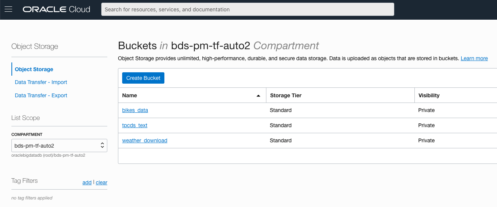
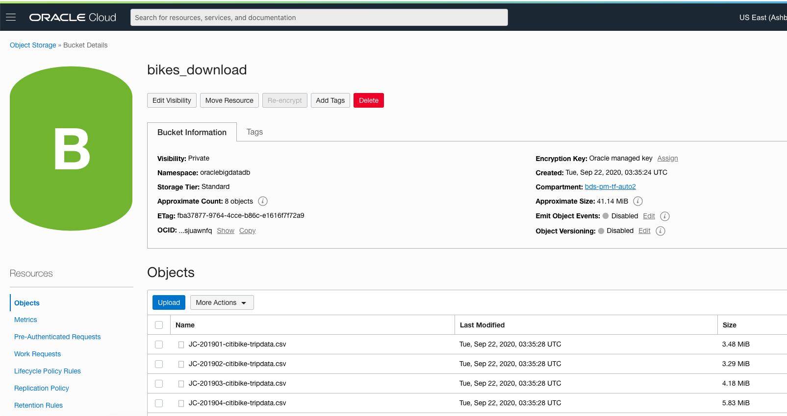
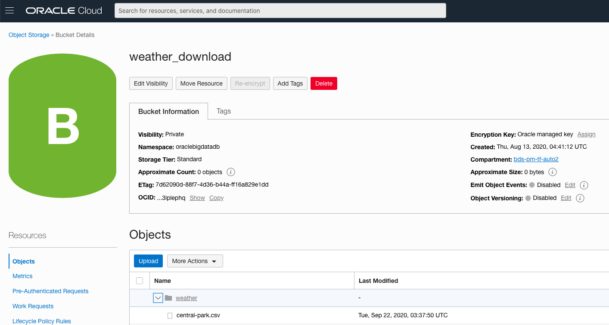
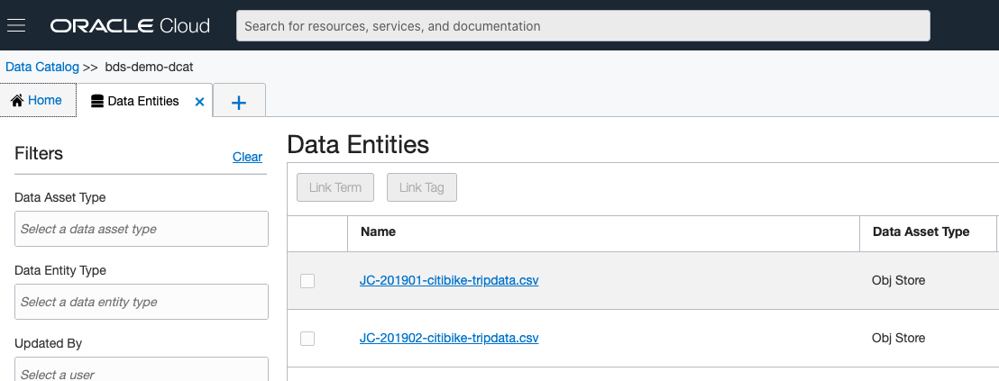
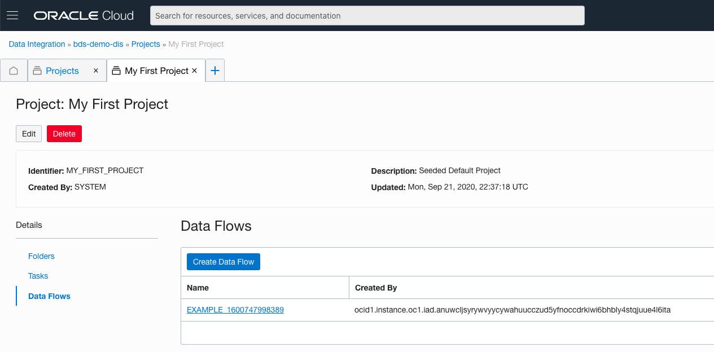
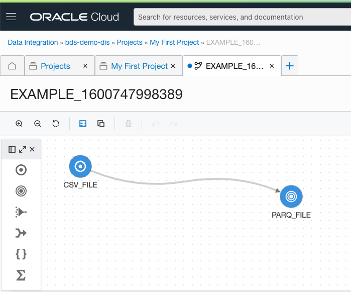

# Big Data Service stack
This terraform scripts allow to user provision stack of OCI resources needed for Big Data Service, including service itself:

- Compartment where all resources will be provisioned
- Couple of Edge Nodes
	- Add these edge nodes into Cloudera manager and deploy cluster config on it
	- Kerberos principal "opc" and add keytab file on Edge nodes (password is the same as Cloudera Manager)
	- Create Load Balancer infront of edge nodes
- Big Data Service
- BDS admin user/password and group (in OCI)
- Security Policies required by:
	- Big Data Service
	- Oracle Function
	- Data Catalog
	- Data Integration Service
	- Add edge nodes into Dynamic Group and allow to manage all resources in the demo compartment
- Network artifacts:
	- VCN
	- Subnet
	- Service Gateways
	- NAT gateway
	- Internet gateway
	- Security lists with appropriate settings
	- Routing tables
	- DHCP
- Public IP (and assign it to Cloudera Manager host)
- Pull zeppelin image on the Cloudera Manager host
- Create Application and "Hello World" function
- Create API gateway
- Create Data Catalog Instance
- Create Data Integration workspace
- Scripts to download test data sets

In order to provision it, user have to follow steps:

1) Provision some client compute instance in OCI (this instance can be removed after terraform scrips finish it work). There are multiple ways, for example:

- Using [OCI Web UI](https://docs.cloud.oracle.com/en-us/iaas/Content/Compute/Tasks/launchinginstance.htm) (reccomended for begginers)
- Using [OCI CLI](https://blogs.oracle.com/linux/easy-provisioning-of-cloud-instances-on-oracle-cloud-infrastructure-with-the-oci-cli) (good for scripting)

2) as part of provisioning you may need to create key pair. Detailed information you can find [here](https://docs.cloud.oracle.com/en-us/iaas/Content/Compute/Tasks/managingkeypairs.htm), to keep it short and match with env-vars.sh settings, just run:

`sudo ssh-keygen -t rsa -N "" -b 2048 -C demoBDSkey -f userdata/demoBDSkey`

Note: to keep it simple I suggest to use same kaypair for BDS cluster and edge node

create Dynamic Group and put this host into this Dynamic Group. More details on how to do this you can find [here](https://youtu.be/7_aVulUrurM?t=2881)

2) after host provisioned, ssh to this host, like this:

`ssh -i myPrivateKey opc@<ip address>`

Note: you can search for host PublicIP on the host page:

3) Install git and terraform:

`$ sudo yum install -y git terraform`

4) clone terrform repository:

`$ git clone https://github.com/filanovskiy/terraform-oci-bds.git`

5) go to repository dir and init terraform provider:

`$ cd terraform-oci-bds`

`$ terraform init`

6) after this user have to fill up enviroment varibles in env-vars.sh

| Name of the varible| Description | Comments |
| ----------- | ----------- | ----------- |
| TF_VAR_tenancy_ocid| Tenancy OCID| Have to be updated|
| TF_VAR_compartment_name   | Name of the compartment, that will be created        |Can leave as is         |
| TF_VAR_home_region   | Home region|Have to be updated|
| TF_VAR_region   | Region where stack will be provisioned|Can leave as is         |
| TF_VAR_bds_instance_cluster_admin_password   | Cloudera Manager admin password|It's better to update        |
| TF_VAR_ssh_keys_prefix   | Prefix of ssh-rsa kay pair|Can leave as is (don't forget to generate keys)|
| TF_VAR_ssh_public_key   | Path to public key|Can leave as is (don't forget to generate keys)|
| TF_VAR_ssh_private_key   | Path to private key|Can leave as is (don't forget to generate keys)|
| TF_VAR_bds_cluster_name   | Big Data Service cluster name| Can leave as is

To obtain tenancy go to the OCI Web UI and click on the user icon in the up right corner and there choose tenancy:

At this page you will need to obtain "TF_VAR_tenancy_ocid" and "TF_VAR_home_region" values

Note: you may want to generate ssh key pair. You may simply run this command to match env-vars.sh config:

`$ sudo ssh-keygen -t rsa -N "" -b 2048 -C demoBDSkey -f userdata/demoBDSkey`

`$ sudo chown opc:opc userdata/demoBDSkey*`

7) apply this enviroment varibles:

`$ source env-vars.sh`

8) Run provisioning:

`$ terraform apply -auto-approve`

9) After script finished, user will see output, containing:
<ul>
<li class="has-line-data" data-line-start="0" data-line-end="1">Edge node IPs</li>
<li class="has-line-data" data-line-start="1" data-line-end="2">Compartment OCID</li>
<li class="has-line-data" data-line-start="2" data-line-end="3">BDS Admin username</li>
<li class="has-line-data" data-line-start="3" data-line-end="4">BDS Admin one time password (you have to change it right after login)</li>
<li class="has-line-data" data-line-start="4" data-line-end="5">Load balancer (balancing edge nodes) IP</li>
<li class="has-line-data" data-line-start="5" data-line-end="7">Cloudera Manager Public IP</li>
</ul>
Example:

bds_admin_usr_one_time_password = r}HZkIp9M 
cm_public_ip = 132.145.147.5 
compartment_OCID = ocid1.compartment.oc1…aaaaaaa…qfeq 
edge_node_ip = [ 
129.213.133.80, 
193.122.136.216, 
] 
lb_public_ip = 193.122.133.54 
resource_compartment_name = bds-tf-demo 
user_name = bds_admin_usr

10) to ssh to edge node, run:
`ssh -i userdata/demoBDSkey opc@<edge ip address>`

11) For login from Edge node to utility node run:

`ssh -i .ssh/bdsKey opc@$CM_IP`

12) In case you want to generate some test datasets, you have to loging into Cloudera Manager node:
`ssh -i .ssh/bdsKey opc@$CM_IP`
after this run the script:
`[opc@bdsdemoun0 ~]$ /home/opc/generate_tpcds_data.sh `

after script done you can check datasets on HDFS:

$  hadoop fs -ls /tmp/tpcds/text 
Found 27 items 
drwxr-xr-x   - opc  supergroup          0 2020-09-22 03:03 /tmp/tpcds/text/call_center 
drwxr-xr-x   - opc  supergroup          0 2020-09-22 03:03 /tmp/tpcds/text/catalog_page 
drwxr-xr-x   - opc  supergroup          0 2020-09-22 03:00 /tmp/tpcds/text/catalog_returns 
… 
drwxr-xr-x   - opc  supergroup          0 2020-09-22 03:03 /tmp/tpcds/text/web_site

Hive:

$ hive -e “show tables” --database tpcds_csv 
… 
customers 
date_dim 
…

also this dataset copied into Object Store:

13) Alternatively you can download into bucket NYC bike trips and weather information. In order to accomplish this, go to one of the edge node and run:

`[opc@bds-demo-egde0 ~]$ ./downloadbikes.sh`

after command is done, you can check that data been appeared into Object Store bucket:

Second dataset available for downloading is weather data. In order to upload it just run:

`[opc@bds-demo-egde0 ~]$ ./downloadweather.sh `

after command is done, you can check that data been appeared into Object Store bucket:

14) If you want harvest data from one of this bucket into Data Catalog, you will need to create some configuration (register Object Store data Asset and create connection):

`[opc@bds-demo-egde0 ~]$ dcat/dcat_stack.sh `

after one time configuration is done, run harvesting Job against some bucket:

`[opc@bds-demo-egde0 ~]$ dcat/dcat_harvest.sh bikes_download`

You can verify results of the job into OCI Data Catalog console:

15) If you want to run some transformations with your data (convert from csv format to parquet for example), you may use Data Integration Service. First you need to register Data Asset (Object Store). Simple way to do so is run the script:

`[opc@bds-demo-egde0 ~]$ dis/dis_crete_da.sh `

The next script will create Data Flow for weather data in case you downloaded it in previous step:

`[opc@bds-demo-egde0 dis]$ dis/create_df_weather`

After script done you can check in OCI UI Created Data Flow:

