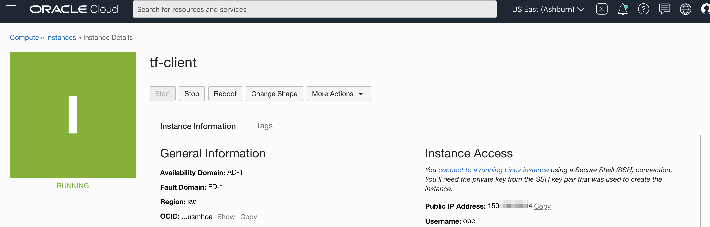
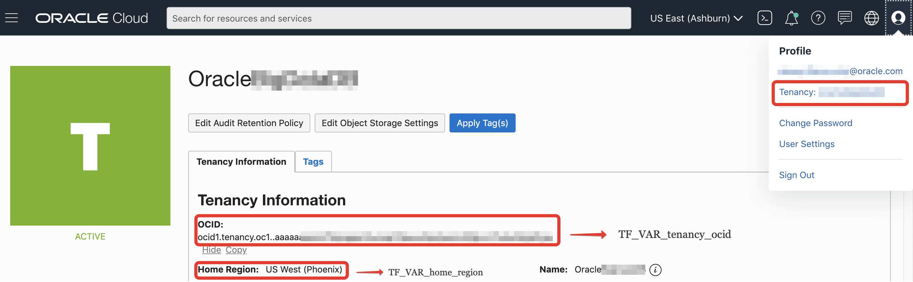

# Big Data Service stack
This terraform scripts allow to user provision stack of OCI resources needed for Big Data Service, including service itself.
In order to provision it, user have to follow steps:

1) Provision some client compute instance in OCI (this instance can be removed after terraform scrips finish it work). There are multiple ways, for example:

- Using [OCI Web UI](https://docs.cloud.oracle.com/en-us/iaas/Content/Compute/Tasks/launchinginstance.htm) (reccomended for begginers)
- Using [OCI CLI](https://blogs.oracle.com/linux/easy-provisioning-of-cloud-instances-on-oracle-cloud-infrastructure-with-the-oci-cli) (good for scripting)

2) as part of provisioning you may need to create key pair. Detailed information you can find [here](https://docs.cloud.oracle.com/en-us/iaas/Content/Compute/Tasks/managingkeypairs.htm), to keep it short and match with env-vars.sh settings, just run:

`sudo ssh-keygen -t rsa -N "" -b 2048 -C demoBDSkey -f userdata/demoBDSkey`

Note: to keep it simple I suggest to use same kaypair for BDS cluster and edge node

2) after host provisioned, ssh to this host, like this:

`ssh -i myPrivateKey opc@<ip address>`

Note: you can search for host PublicIP on the host page:

3) Install git:

`$ sudo yum install -y git`

4) clone terrform repository:

`$ git clone https://github.com/filanovskiy/terraform-oci-bds.git`

5) go to repository dir and init terraform provider:

`$ cd terraform-oci-bds`

`$ terraform init`

6) after this user have to fill up enviroment varibles in env-vars.sh

| Name of the varible| Description | Comments |
| ----------- | ----------- | ----------- |
| TF_VAR_tenancy_ocid| Tenancy OCID| Have to be updated|
| TF_VAR_compartment_name   | Name of the compartment, that will be created        |Can leave as is         |
| TF_VAR_home_region   | Home region|Have to be updated|
| TF_VAR_region   | Region where stack will be provisioned|Can leave as is         |
| TF_VAR_bds_instance_cluster_admin_password   | Cloudera Manager admin password|It's better to update        |
| TF_VAR_ssh_keys_prefix   | Prefix of ssh-rsa kay pair|Can leave as is|
| TF_VAR_ssh_public_key   | Path to public key|Can leave as is|
| TF_VAR_ssh_private_key   | Path to private key|Can leave as is|

To obtain tenancy go to the OCI Web UI and click on the user icon in the up right corner and there choose tenancy:

At this page you will need to obtain "TF_VAR_tenancy_ocid" and "TF_VAR_home_region" values

Note: you may want to generate ssh key pair. You may simply run this command to match env-vars.sh config:

`$ sudo ssh-keygen -t rsa -N "" -b 2048 -C demoBDSkey -f userdata/demoBDSkey`

7) apply this enviroment varibles:

`$ source env-vars.sh`

8) Run provisioning:

`$ terraform apply -auto-approve`